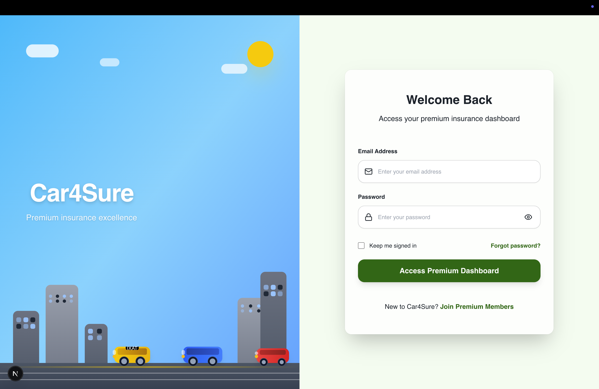

# Car4Sure Frontend

Premium Insurance Policy Management System - Frontend Application



## 🚀 Overview

Car4Sure is a modern, responsive web application for managing insurance policies. Built with Next.js 15 and TypeScript, it provides a comprehensive platform for policy creation, management, and tracking with an elegant user interface.

## ✨ Features

### 🔐 Authentication & Authorization
- Secure login and registration system
- Token-based authentication with Laravel Sanctum
- Protected routes and role-based access
- Password reset functionality

### 📋 Policy Management
- **Create Policies**: Comprehensive policy creation wizard
- **View Policies**: Detailed policy information display
- **Edit Policies**: Update existing policy details
- **Search & Filter**: Advanced search and filtering capabilities
- **PDF Generation**: Download policy documents as PDF

### 🚗 Insurance Features
- **Multi-Vehicle Support**: Add multiple vehicles per policy
- **Driver Management**: Manage multiple drivers per policy
- **Coverage Options**: Flexible coverage types and limits
- **Address Management**: Policy holder and garaging addresses

### 🎨 User Experience
- **Responsive Design**: Mobile-first responsive interface
- **Dark/Light Theme**: Modern design with theme support
- **Real-time Updates**: SWR for efficient data fetching
- **Interactive Forms**: React Hook Form with validation
- **Loading States**: Smooth loading animations and states

## 🛠 Tech Stack

### Core Technologies
- **[Next.js 15](https://nextjs.org/)** - React framework with App Router
- **[TypeScript](https://www.typescriptlang.org/)** - Type-safe JavaScript
- **[React 18](https://reactjs.org/)** - User interface library

### Styling & UI
- **[Tailwind CSS 4](https://tailwindcss.com/)** - Utility-first CSS framework
- **[Shadcn/ui](https://ui.shadcn.com/)** - Re-usable component library
- **[Lucide React](https://lucide.dev/)** - Beautiful icon library

### State Management & Data Fetching
- **[SWR](https://swr.vercel.app/)** - Data fetching and caching
- **[Axios](https://axios-http.com/)** - HTTP client for API requests

### Form Management
- **[React Hook Form](https://react-hook-form.com/)** - Performant forms
- **[Zod](https://zod.dev/)** - TypeScript-first schema validation
- **[Hookform Resolvers](https://github.com/react-hook-form/resolvers)** - Validation integration


## 📁 Project Structure

```
├── app/                    # Next.js App Router pages
│   ├── (auth)/            # Authentication pages
│   │   ├── login/         # Login page
│   │   └── register/      # Registration page
│   ├── dashboard/         # Dashboard page
│   ├── policies/          # Policy management
│   │   ├── create/        # Create policy
│   │   └── [id]/          # Policy details & edit
│   ├── globals.css        # Global styles
│   ├── layout.tsx         # Root layout
│   └── page.tsx           # Home page
├── components/            # Reusable components
│   ├── ui/                # Shadcn/ui components
│   ├── layout/            # Layout components
│   └── auth-guard.tsx     # Authentication guard
├── hooks/                 # Custom React hooks
│   ├── useAuth.ts         # Authentication hook
│   ├── usePolicy.ts       # Policy management hook
│   └── use-mobile.ts      # Mobile detection hook
├── lib/                   # Utility libraries
│   ├── axios.ts           # Axios configuration
│   ├── utils.ts           # General utilities
│   └── validations.ts     # Zod schemas
├── types/                 # TypeScript type definitions
│   ├── auth.ts            # Authentication types
│   ├── policy.ts          # Policy types
│   └── api.ts             # API response types
└── public/                # Static assets
```

## 🚀 Getting Started

### Prerequisites

- **Node.js 18+** - [Download Node.js](https://nodejs.org/)
- **npm, yarn, or pnpm** - Package manager
- **Git** - Version control

### Installation

1. **Clone the repository**
   ```bash
   git clone https://github.com/your-username/car4sure-frontend.git
   cd car4sure-frontend
   ```

2. **Install dependencies**
   ```bash
   npm install
   # or
   yarn install
   # or
   pnpm install
   ```

3. **Environment Setup**
   ```bash
   cp .env.example .env.local
   ```

4. **Configure environment variables**
   ```env
   # API Configuration
   NEXT_PUBLIC_API_URL=http://localhost:8000/api
   
   # App Configuration
   NEXT_PUBLIC_APP_NAME=Car4Sure
   NEXT_PUBLIC_APP_URL=http://localhost:3000
   ```

5. **Start the development server**
   ```bash
   npm run dev
   # or
   yarn dev
   # or
   pnpm dev
   ```

6. **Open your browser**
   
   Navigate to [http://localhost:3000](http://localhost:3000)

## 🔧 Available Scripts

- **`npm run dev`** - Start development server
- **`npm run build`** - Build for production
- **`npm run start`** - Start production server
- **`npm run lint`** - Run ESLint
- **`npm run lint:fix`** - Fix ESLint issues
- **`npm run type-check`** - Run TypeScript type checking

## 🌐 API Integration

The frontend communicates with the Laravel backend through RESTful APIs:

### Authentication Endpoints
- `POST /api/register` - User registration
- `POST /api/login` - User login
- `POST /api/logout` - User logout
- `GET /api/user` - Get authenticated user

### Policy Management Endpoints
- `GET /api/policies` - List policies with pagination
- `POST /api/policies` - Create new policy
- `GET /api/policies/{id}` - Get policy details
- `PUT /api/policies/{id}` - Update policy
- `DELETE /api/policies/{id}` - Delete policy
- `POST /api/policies/{id}/pdf` - Generate policy PDF

## 🎨 Design System

### Colors
- **Primary**: Emerald/Teal gradient
- **Secondary**: Cyan accents
- **Neutral**: Slate grays
- **Status**: Green (success), Yellow (warning), Red (error)

### Typography
- **Headings**: Space Grotesk font family
- **Body**: DM Sans font family
- **UI Scale**: Responsive typography scale

### Components
Built with Shadcn/ui component library:
- Forms, Buttons, Cards
- Navigation, Modals, Dropdowns
- Data tables, Pagination
- Loading states, Animations

## 🔒 Security Features

- **Token-based Authentication** - Secure JWT token storage
- **Protected Routes** - Authentication guards
- **Input Validation** - Client-side and server-side validation
- **XSS Protection** - Sanitized inputs and outputs
- **CSRF Protection** - Cross-site request forgery prevention

## 📱 Responsive Design

- **Mobile-first approach** - Optimized for mobile devices
- **Breakpoints**: 
  - `sm`: 640px and up
  - `md`: 768px and up
  - `lg`: 1024px and up
  - `xl`: 1280px and up

## 🚀 Deployment

### Vercel (Recommended)

1. **Push to GitHub**
   ```bash
   git push origin main
   ```

2. **Deploy to Vercel**
   ```bash
   npx vercel
   ```


``